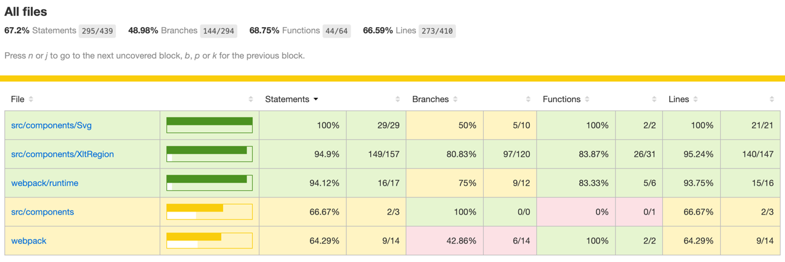

# Region 行政区域选择器

简洁强大的中国行政区划选择器，可选择 “省/直辖市”、“市”、“区/县”、“乡/镇/街道” 4 级行政区域

行政区划数据源:来自插件`@gok/area-data`

## 功能特性

- 支持 “省/直辖市”、“市”、“区/县”、“乡/镇/街道” 4 级行政区域选择
- 除省级和市级以外，其它行政区域级别允许通过参数进行“打开/关闭”
- 支持数据双向绑定
- 支持设置默认值

## 后续计划

- [x] 打包实现三级行政区域选择器，不包含街道
- [ ] 城市选择器模式
- [ ] 支持自定义数据源
- [ ] 按拼音首字母分组排序的功能

## 安装插件

使用`npm/pnpm`把插件安装到项目中

```shell
# npm
npm install @xlt-group/xlt-region

# pnpm
pnpm add @xlt-group/xlt-region
 
```

在项目入口`main.js`中引入插件

```js
import Vue from 'vue'
import XltRegion from '@xlt-group/xlt-region'

#
四级行政区域
import XltRegion from '@xlt-group/xlt-region/no-street'

#三级行政区域

Vue.use(XltRegion)
```

自定义全局注册组件

```js
import Vue from 'vue'
import {XRegion} from '@xlt-group/xlt-region'

Vue.component('x-region', XRegion)
```

在页面/模块中使用

```vue

<template>
  <x-region @on-change="regionChange"/>
</template>

<script>
export default {
  methods: {
    // 选择器值改变时触发
    regionChange(data) {
      console.log(data)
    }
  }
}
</script>
```

使用本地注册的组件

```vue

<template>
  <x-region @on-change="regionChange"/>
</template>

<script>
import {XRegion} from '@xlt-group/xlt-region

export default {
  components: {
    XRegion
  },
  methods: {
    // 选择器值改变时触发
    regionChange(data) {
      console.log(data)
    }
  }
}
</script>
```

使用数据双向绑定`v-model`

```vue

<script>
export default {
  name: 'App',
  data() {
    return {
      areaData: {},
    }
  },
  watch: {
    areaData(val) {
      console.log(val, 35)
      //{area:150522,city:1505,province:15,street:150522208}
    }
  }
}
</script>
<template>
  <div id="app">
    <city-region v-model="areaData"></city-region>
  </div>
</template>
```

使用默认值

```vue

<script>
export default {
  name: 'App',
  data() {
    return {
      areaData: {
        area: 150522,
        city: 1505,
        province: 15,
        street: 150522208,
      }
    }
  },
  watch: {
    areaData(val) {
      console.log(val, 35)
    }
  },
}
</script>
<template>
  <div id="app">
    <city-region v-model="areaData"></city-region>
  </div>
</template>
```

## 入参选项

| 参数              | 说明                                                                  | 类型      | 默认值  | 必填    | 示例                                      |
|-----------------|---------------------------------------------------------------------|---------|------|-------|-----------------------------------------|
| value/v-model   | 初始化行政区划选中项目 province 省、直辖市及特别行政区编码,city 城市编码,area 区/县编码,street 乡镇编码 | object  | {}   | false | {province:'',city:'',area:'',street:''} |
| level           | 需要展示的层级 level=3 展示区县 level=4  展示乡镇                                  | Number  | 4    | false | 4                                       |
| separator       | 区域文本间的分隔符                                                           | String  | /    | false | /                                       |
| mouseLeaveClose | 鼠标离开选择器是否关闭下拉菜单                                                     | Boolean | true | false | true                                    |

## 事件

| 事件名称      | 说明                | 返回数据                                                                             |
|-----------|-------------------|----------------------------------------------------------------------------------|
| on-change | 	响应已选中的行政区划完整数据模型 | `{address:[15,1505,150522,150522208],select:[{n:'内蒙古自治区',i:15,p:0,y:'n'},....]}` |

## 测试报告

XltRegion

- [x] 默认当前选中行政区域tab为省份 (4ms)

- [x] 默认展示34个省份 (4ms)

- [x] 默认操作栏标题展示'选择省份/地区' (2ms)

- [x] 点击省份/地区的'暂不选择'，关闭弹窗，返回值为空 (5ms)

- [x] 选择'福建省'，当前级别自动切换至'市'级 (23ms)

- [x] 点击市的'暂不选择'，关闭弹窗，返回值为省级有值，市为空 (2ms)

- [x] 选择'福州市'，当前级别自动切换至'区/县' (15ms)

- [x] 点击区县的'暂不选择'，关闭弹窗，返回值为省，市，区县为空 (3ms)

- [x] 选择'鼓楼区'，当前级别自动切换至'街道/乡镇' (9ms)

- [x] 点击街道的'暂不选择'，关闭弹窗，返回值为省，市，区县，街道/乡镇为空 (3ms)

- [x] 选择'东街街道'，关闭弹窗，返回选中后的值 (4ms)

- [x] 再次打开选择器，默认选中'街道/乡镇','东街街道'高亮显示 (2ms)

- [x] 切换tab至'区/县'，'鼓楼区'选中高亮 (4ms)

- [x] 切换tab至'市'，'福州市'选中高亮 (3ms)

- [x] 切换tab至'省'，'福建省'选中高亮 (15ms)

- [x] 使用对象对v-model/value 设置默认值 (36ms)

- [x] 使用数组对v-model/value 设置默认值 (25ms)

- [x] 点击 X 图标，所有选中行政区域数据应该被清空 (8ms)



